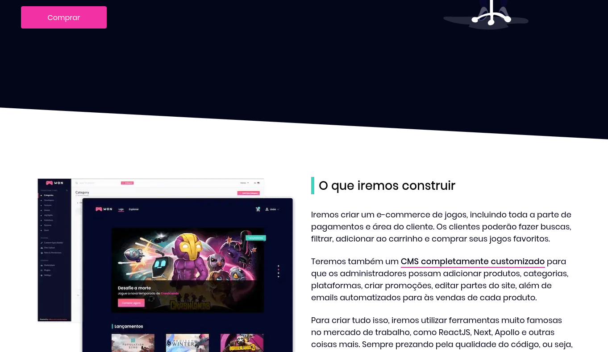
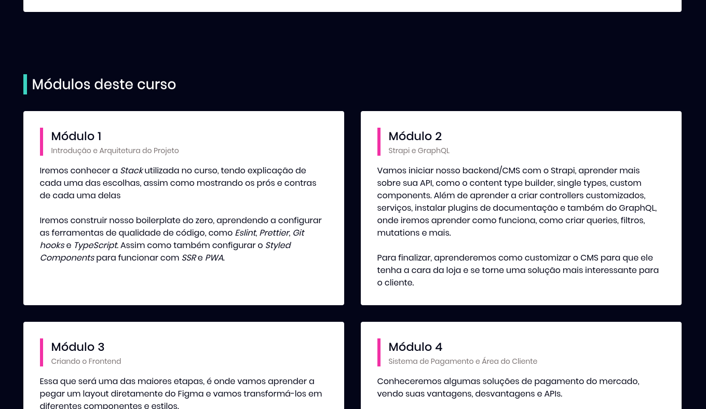
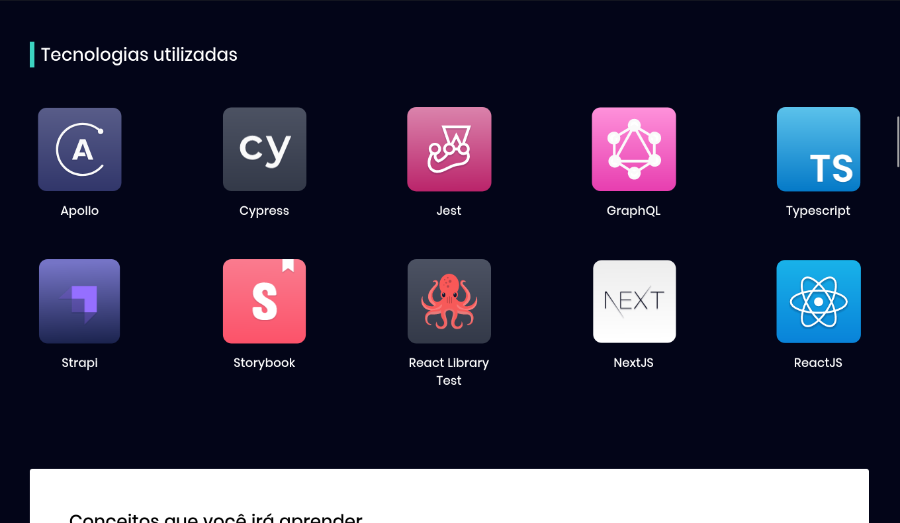

<p align="center">
  <a href="https://nextjs.org/" target="blank"></a>
</p>

<p align="center">
  <a href="#-tecnologias">Tecnologias</a>&nbsp;&nbsp;&nbsp;|&nbsp;&nbsp;&nbsp;
  <a href="#-projeto">Projeto</a>&nbsp;&nbsp;&nbsp;|&nbsp;&nbsp;&nbsp;
  <a href="#-como-executar">Como executar</a>&nbsp;&nbsp;&nbsp;|&nbsp;&nbsp;&nbsp;
  <a href="#-licença">Licença</a>
</p>

<p align="center">
  
</p>

<p align="center">
  
</p>

<p align="center">
    
</p>

<p align="center">
  
</p>

<br>

<a id="-tecnologias"></a>

## ✨ Tecnologias

Esse projeto foi desenvolvido com as seguintes tecnologias:


<a id="-projeto"></a>

## 💻 Projeto

Uma landing page que consome conteúdos a partir de uma HeadLess CMS Server (esse sendo o Strapi) em uma API graphQL para fazer as query's de conteúdos dinâmicos.

<a id="-como-executar"></a>

## 🚀 Como executar

### 💻 Pré-requisitos

Antes de começar, verifique se você atendeu aos seguintes requisitos:

- Você instalou a versão mais recente de `< NodeJS >`

- Você tem uma máquina `< Windows / Linux / Mac >`.

- Você possui um `< Editor de código ou IDE / Gerenciador de banco de dados >`.

## ☕ Pequena ajuda

Preencha o arquivo `.env.example` com as informações cobradas e depois renomeie para `.env`.

```env
// GRAPHQL_HOST sendo o backend desse mesmo repositório
GRAPHQL_HOST=http://127.0.0.1:1337/graphql
NEXT_PUBLIC_IMAGE_HOST=http://localhost:1337

```

## Configurando a aplicação antes de iniciar :gear:

Primeiro, instale todas as Gems que são cobradas no GemFile:

```bash
pnmp install // yarn install // npm install
```

### Se lembre de ter o Docker rodando :ocean:

E então, suba o backend da outra pasta com o comando `docker-compose up --build -V`.

Agora você pode acessar [localhost:1337](localhost:1337) do seu navegador.

Depois de ter configurado todo o Strapi, acesse o front através do link [localhost:3000](localhost:3000)

<a id="licença"></a>

## 📄 Licença

Esse projeto está sob a licença MIT. Veja o arquivo [LICENSE](../LICENSE.md) para mais detalhes.

---

#### _Sinta-se livre para colaborar, toda ajuda é bem vinda ;)_
